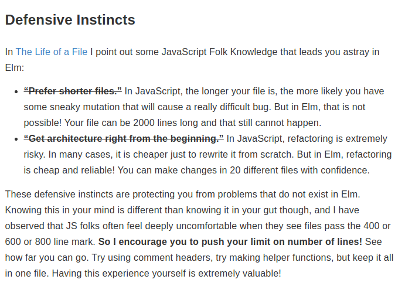
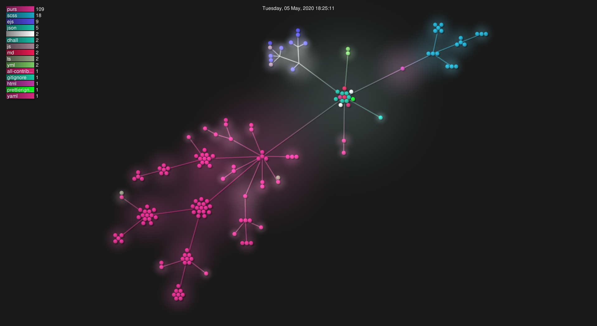

# Tehnologii

Proiectul a fost scis in [PureScript](https://www.purescript.org/), un limbaj de programare pur functional cu sintaxa aproape indentica cu Haskell dar care poate compila in JavaScript.

- Pentru randare web am folosit [Halogen](https://github.com/purescript-halogen/purescript-halogen), o biblioteca care extinde arhitectura Elm cu suport pentru mai mult de un component, alegerea oricarui monad pentru rularea interfatei si multe altele.
- Pentru pacakge managementul dependentelor de pe [npm](https://www.npmjs.com/) am folosit [pnpm](https://pnpm.js.org/) - un CLI care rezolva multe din problemele actuale aflate in npm, iar pentru (package managementul) dependentelor pentru purescript am folosit [Spago](https://github.com/purescript/spago).
- Pentru bundling-ul aplicatiei am folosit [Parcel](https://parceljs.org/) iar pentru stilizare am folosit [scss](https://sass-lang.com/).
- Pentru deducerea tipurilor am implementat [algoritmul Hindley Milner de deducere a tipurilor](https://en.wikipedia.org/wiki/Hindley%E2%80%93Milner_type_system) impreuna cu un sistem care transforma programele vizuale intr-o expresie lineara.
- Proiectul foloseste [Hygen](https://www.hygen.io/) pentru creerea de template-uri ce pot fi refolosite.
- Pentru a recompila partea de PureScript si back-end-ul la fiecare schimbare am folosit [nodemon](https://nodemon.io/).
- Proiectul respecta standardul [all-contributors](https://github.com/all-contributors/all-contributors)
- Pentru CI & CD am folosit [semantic-release](https://semantic-release.gitbook.io/semantic-release/) impreuna cu [github-actions](https://github.com/features/actions)

# Arhitectura

PureScript este un limbaj de programare pur functional. Nici o functie nu are effecte secundare si totul este invariabil.

## Cod de la dreapta la stanga

In limaje cum ar fi F# sau Elm este destul de normal ca aplicarea functiilor sa se faca de la stanga la dreapa folosind `|>`:

```fsharp
1 |> foo |> bar |> goo
```

PureScript a mostenit o multime de lucrucri de la Haskell, si chiar daca este posibil sa facem acelasi lucru ca in F# este recomandat ca aplicarea functiilor sa fie  facut de la dreapa la stanga:

```haskell
goo $ bar $ foo 1
```

## Lentile

O vorba celebra zice (parafrazat in romana):

```
Ce separa un programator de Haskell de un programator de Rust? Programatorul de Rust tot desface structuri in timp ce programatorul de Haskell lucreaza cu ele in orice forma
```

Pentru a lucra cu structuri complexe de date am folosit lentile. In PureScript conventia este ca numele de lentile sa inceapa cu `_`. (Eg: `_NodeGroupNodes`)

## Daca nu exista mutatii, cum se tine minte stateul?

In purescript exista typeclassul `MonadState`. Acest typeclass generalizeaza structurile care tin in interiorul lor un state. Cel mai cunoscut exemplu este cel folosind functii si tupluri:

```haskell
foo state = (someValueDependeingOnState, newState)
```

Chiar daca nici o variabila nu poate fi schimbata, putem returna un now state. Prin intermediul operatiilor monadice si al notatiei `do` nu trebuie sa scriem totate aceste lucruri manual, cea ce creaza un workflow in care avem posibilitatea sa folosim un state fara a fi expusi la bugurile create de acest concept de obicei in programarea imperativa.

### Denumirea modulelor

Pentru a denumi fiecare modul mi-am pus intrebarea "daca acest modul ar fi in interiorul unei biblioteci, cum ar fi numit?", si apoi am adaugat `Lunarbox.` in fata raspunsului. De exemplu cand am vrut sa implementez conceptul de `Camera` am creiat modulul `Lunarbox.Data.Editor.Camera`

### Denumirea variabilelor

In programarea functionala este un lucru foarte obisnuit sa denumim a versiune updatata a lui `<name>` `<name>'`

### Fisiere lungi

In programarea imperativa este considerata o practica buna ca fisierele sa fie de sub 200 de linii. In programarea functionala asta nu conteaza, deoarece totul este foarte sigur , iar principiul compozitiei este folosit din plin, fisierele cu peste 500 de linii de cod ne fiind ceva special in proiectele mari. De exemplu aici este o sectiune din documentatia pentru [Elm](https://elm-lang.org/) (un alt limbaj de programare functionala): 

De exemplu fisierul State.purs contine o multime de functii micute ce manipuleaza diverse parti ale editorului. Fisierul are peste 750 de linii, dar de ce as impartii in mai multe fisiere cand toate functiile au legatura cu acelasi lucru?

## Portabilitate

Aplicatia ruleaza pe orice PC ce poate rula o versiue recenta de Chrome sau Firefox.

## Testarea

Proiectul se bazeaza cel mai mult pe user-testing, dar am scris si cateva unit test-uri pentru a ma asigura ca algoritmul de aranjare a arcurilor pe mai multe cercuri functioneaza cu mult inainte de a implementa partea grafica.

# Gestionarea codului

De la inceput am folosit [git](https://git-scm.com/). Deoarece in fiecare repository (front-end / back-end) a lucrat o singura persoana am folosit un sistem de branching destul de simplu:

## Ci & Cd

Branchul default este `develop` care contine cele mai recente surse ale aplicatii. Fiecare commit in develop este testat si construit automat folosind GitHub actions. Mereu cand vreau sa fac un release creeez un pull request in `master`. Dupa ce totul e testat si compilat se genereaza un changelog din commituri (acest lucru este posibil deoarece folosesc [Conventional Commits](https://www.conventionalcommits.org/en/v1.0.0/)) si un GitHub release avand ca descriere sectiunea din changelog a respectibului release. Dupa acesti pasi proiectul este publicat automat pe [netlify](https://www.netlify.com/).

## Structura de fisiere

Aici este o randare a structurii de fisiere generata folosind [gource](https://gource.io/)


